# Ensign

Welcome to the Ensign project, featuring two unique typefaces designed to enhance your cryptographic and creative endeavors: **Cheiro** and **Clypto**.

## Cheiro

Cheiro is a handwriting-inspired font that brings a personal touch to digital communication. Its fluid, organic contours mimic the irregularity and charm of handwritten text, making it perfect for personal notes, invitations, and any project where a human touch is desired.

**Demonstration of Cheiro:**
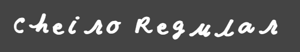
Header in Cheiro font.
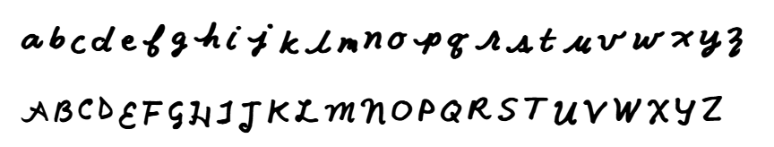
Sample text showcasing the Cheiro typeface.
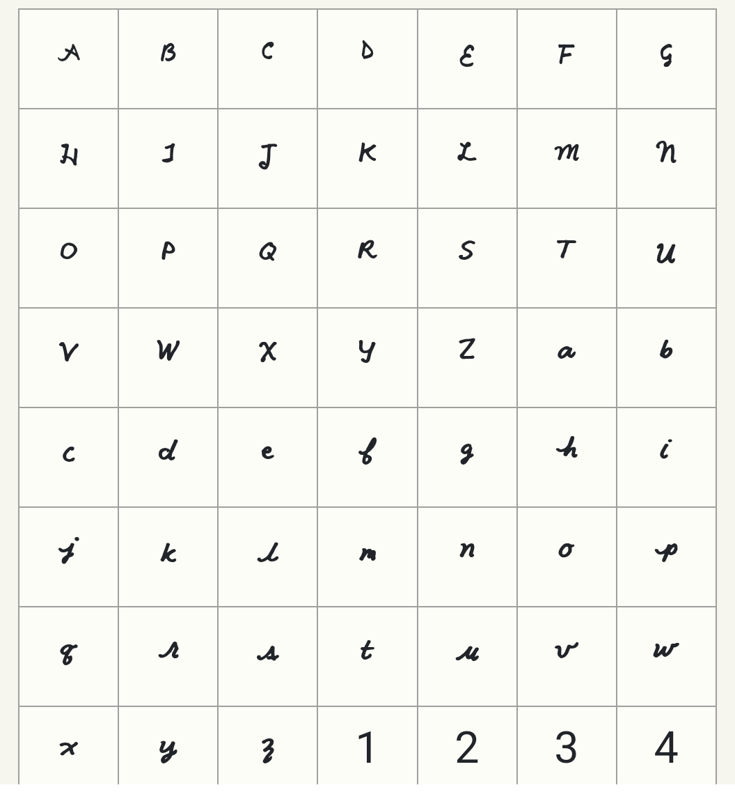
Grid showing all glyphs available in the Cheiro font.
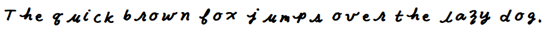
A phrase written in Cheiro.
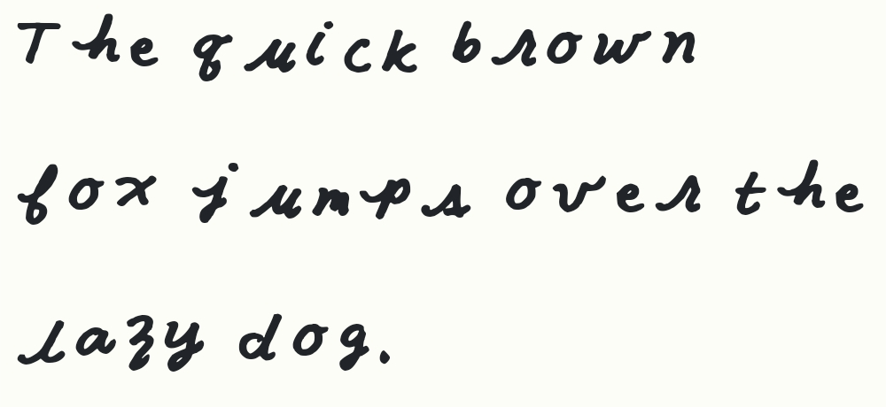
An alternate phrasing in Cheiro.
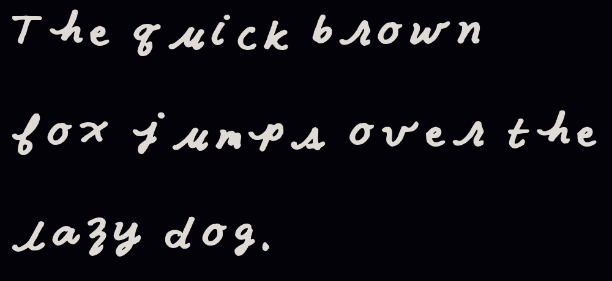
Inverted version of the alternate phrasing for dark mode displays.
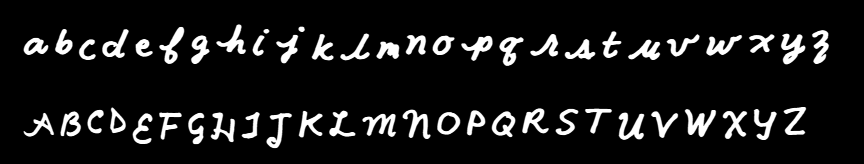
Sample text in Cheiro, inverted for dark mode.

## Clypto

Clypto offers a unique twist on readability by presenting only partial letters, challenging the reader to mentally complete them. This partial lettering style serves not only as a stylistic choice but also adds a layer of light cryptography to any text written in it, ideal for intriguing headers and cryptic messages.

**Demonstration of Clypto:**

Header in Clypto font.
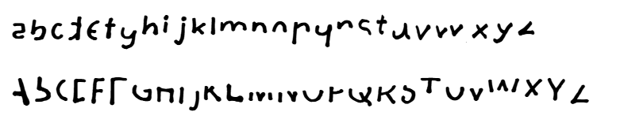
Sample text showcasing the Clypto typeface.
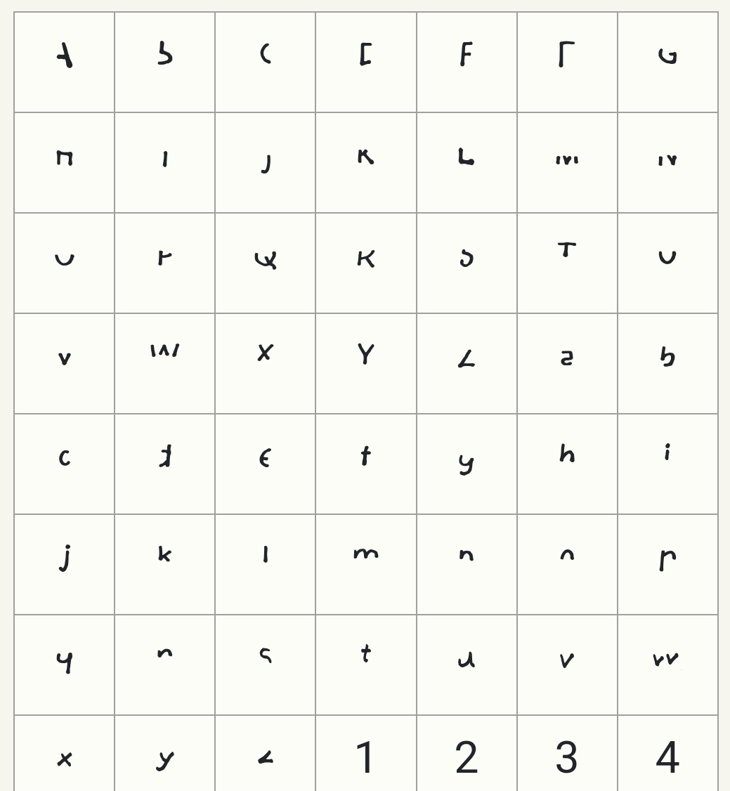
Grid showing all glyphs available in the Clypto font.
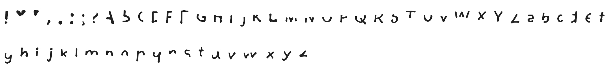
Detailed view of select glyphs in Clypto.
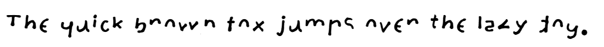
A phrase written in Clypto.
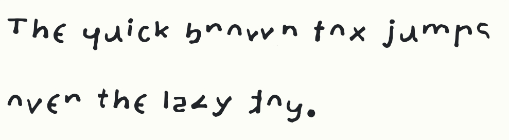
An alternate phrasing in Clypto.
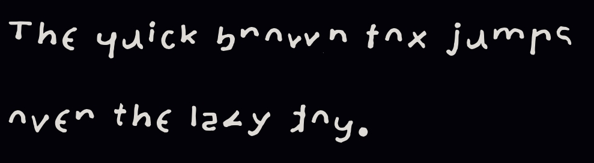
Inverted version of the alternate phrasing for dark mode displays.
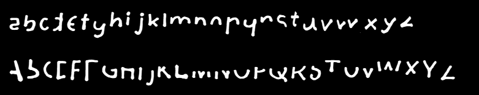
Sample text in Clypto, inverted for dark mode.
